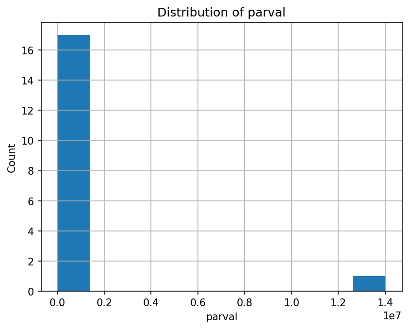
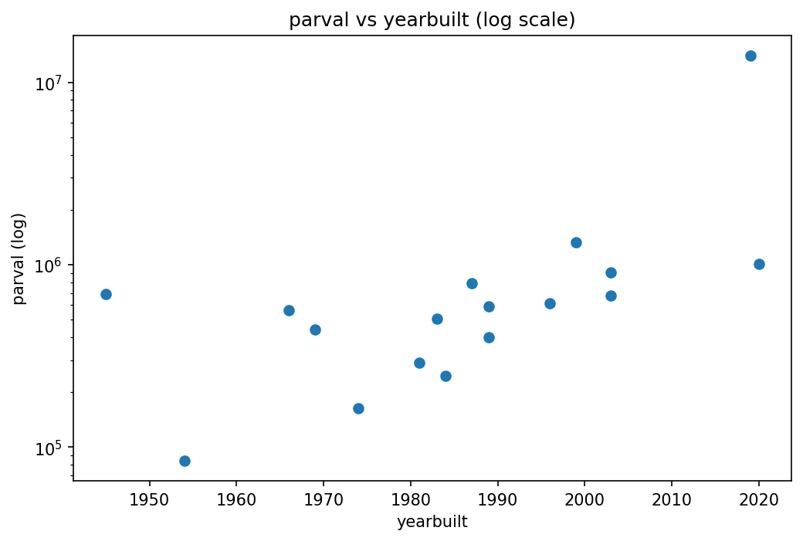
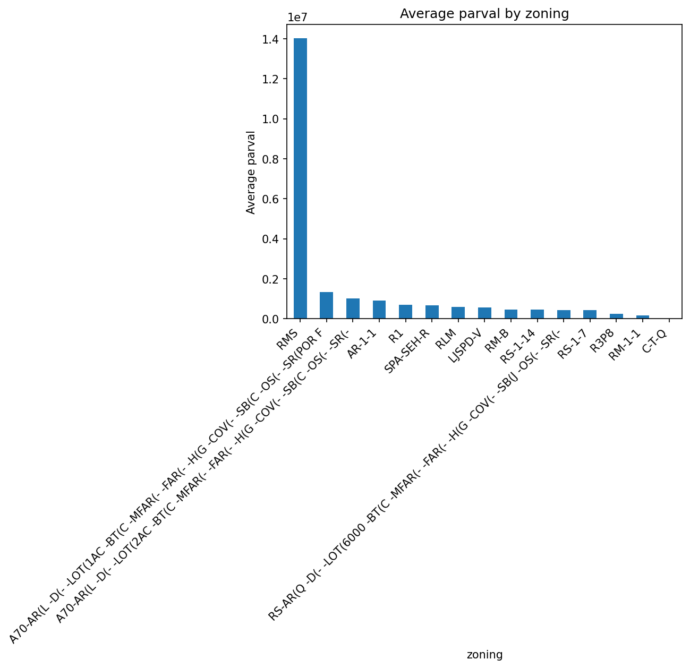

# Title
Local Housing Market Analysis
## Project Goals
* Lead and inspect a real public housing dataset
* Evaluate data quality and identify missing or unusable fields
* Perform basic analysis and visualization
## Initial Market
* Region: San Diego County, CA
## Dataset (Initial)
* File: ca_san_diego.csv
* Source: app.regrid.com, San Diego County, CA
* Records: 20 properties
* Columns: 203
* Data type: Property assesor and land-use information
* Level of Analysis: Parcel/ZIP-code level
#### Note: This project currently uses a sample data set for learning/pipeline development. Findings are not representative of the full San Diego housing market.
## Project structure
* housing-intelligence/
  * data/
      * raw/
      * processed/
  * figures/
  * notebooks/
  * README.md
  * requirements.txt

## Tools and Technologies
* Python
* pandas for data manipulation
* Jupyter Notebooks for documentation and analysis

## How to Run
1. Install dependencies:
  pip install -r requirements.txt
2. Run notebooks in order:
- notebooks/01_initial_eda.ipynb
- notebooks/02_data_cleaning.ipynb
- notebooks/03_basic_cleaning.ipynb
- (and so on)

## Sample Visualizations

